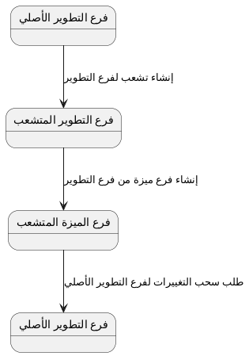

# دليل المساهمة

هذا المستند يوضّح الطرق المختلفة للمساهمة في المشروع والقواعد التي يجب اتباعها لضمان جودة المشروع واستمراريته

---

## 📋 جدول المحتويات

1. [المصطلحات المستخدمة](#-المصطلحات-المستخدمة)
2. [الإبلاغ عن الأخطاء](#-الإبلاغ-عن-الأخطاء)
3. [اقتراح ميزات أو تحسينات](#-اقتراح-ميزات-أو-تحسينات)
4. [المساهمة بطلبات السحب](#-المساهمة-بطلبات-السحب)
5. [المساهمة في الترجمة](#-المساهمة-في-الترجمة)

---

## 📜 المصطلحات المستخدمة

- قضية => Issue
- طلب سحب => Pull Request
- سحب => pull
- دفع/رفع => push
- التزام => commit
- مستودع => Repository
- تشعّب => Fork
- دمج => Merge
- هرس => Squash
- إسناد => Assign
- خطأ => Bug
- مقطع => Video
- سلسلة => Playlist

---

## 🐛 الإبلاغ عن الأخطاء

الإبلاغ عن الأخطاء يكون عبر نظام **القضايا** في مستودع GitHub

قبل إنشاء تقرير خطأ جديد، يُرجى البحث في القضايا الموجودة للتأكد من أن الخطأ لم يُبلَّغ عنه مسبقًا

### متطلبات التقرير

1. **معلومات البيئة:**

- نوع الجهاز (مثال: حاسوب مكتبي أو هاتف جوال أو جهاز لوحي)
- نظام التشغيل (مثال: Windows أو Linux أو Andoird)
- نوع المتصفح وإصداره (مثال: Brave أو Firefox)
- رابط الصفحة التي ظهر فيه الخطأ

2. **خطوات إنتاج الخطأ:**

- اذكر خطوات إظهار الخطأ بالترتيب
- اذكر جميع التفاصيل المملة حتى يتمكن الفريق من تكرار المشكلة

3. **تأثير الخطأ على التجربة:**

- صِف كيف يؤثر هذا الخطأ على تجربتك للتطبيق
- هل يمنع المستخدم من إتمام مهمة ما؟ هل يتسبب في تعطّل التطبيق؟ هل يؤثر على جودة المشاهدة؟

### مثال على تقرير خطأ جيد

```
## معلومات البيئة

- **الجهاز:** هاتف ذكي
- **نظام التشغيل:** Samsung Galaxy S23
- **المتصفح:** Chrome 120
- **الصفحة:** https://salasel.app/ar

## خطوات إنتاج الخطأ

1. افتح التطبيق على الجهاز المحمول
2. انتقل إلى أي قائمة تشغيل
3. شغّل على أي مقطع
4. دوّر الشاشة إلى الوضع الأفقي

## التأثير على التجربة

يتوقف المقطع عن العمل عند تدوير الشاشة ولا يمكن استئنافه إلا بعد إعادة تحميل الصفحة

يُعيق هذا تجربة المشاهدة الكاملة
```

---

## 💡 اقتراح ميزات أو تحسينات

تقديم مقترحات الميزات والتحسينات يكون عبر نظام **القضايا** في مستودع GitHub

### متطلبات مقترح الميزة

1. **الوصف:**

- اشرح الميزة المقترحة بوضوح ودقة
- إن أمكن، أرفق أمثلة أو لقطات شاشة توضيحية

2. **مكاسب المستخدم حال وجودها:**

- صِف الفائدة العملية التي ستضيفها هذه الميزة للمستخدمين
- كيف ستُحسّن تجربة مشاهدة المحتوى أو التفاعل مع التطبيق؟

3. **مخاسر المستخدم حال غيابها:**

- صِف المشكلة أو النقص الحالي الذي تعالجه هذه الميزة
- هل غيابها يُعيق المستخدمين؟ هل يضطرون إلى حلول بديلة معقدة؟

### مثال على مقترح ميزة جيد

```
## الوصف

إضافة زر "إضافة إلى قائمة المشاهدة لاحقًا"

## مكاسب المستخدم

يمكن للمستخدمين حفظ المقاطع التي يريدون مشاهدتها لاحقًا دون الحاجة لتذكرها

## مخاسر المستخدم

حاليًا، يضطر المستخدمون إلى البحث يدويًا عن المقاطع كل مرة، مما يُقلل راحة الاستخدام ويُضيّع وقتهم

```

---

## 🔀 المساهمة بطلبات السحب

### القواعد الأساسية

- **كل طلب سحب يُنفّذ قضية:** لا تُقبل طلبات السحب بغير بقضية مسبقة تناقش تفاصيلها مع مشرفي المشروع قبل تنفيذها، **إلا حال كونها إصلاحًا لخطأ**
- **لا تعمل على قضية مُسنَدة لشخص آخر:** نفّذ فقط القضايا التي لم تُسنَد لأحد
- **كل قضية لها فرع وطلب سحب مستقل:** لا يُسمح بدمج عدة قضايا في فرع واحد أو طلب سحب واحد

### سير عمل المساهمة

اتبع الخطوات التالية بالترتيب:

1. **تعريف القضية:**

- ابحث عن قضية مفتوحة وغير مُسنَدة أو أنشئ قضية جديدة
- يمكنك التعليق على القضايا المعتمدة من قبل المشرفين لإخبار المساهمين الآخرين أنك تعمل عليها

2. **تشعيب المستودع:**

- اضغط على زر **Fork** في صفحة المستودع الرئيسي على GitHub لإنشاء نسخة خاصة بك
- ثم حمل نسختك من المستودع على جهازك للعمل عليها

3. **إنشاء فرع العمل من فرع `dev`:**

```bash
git checkout dev

git pull origin dev

git checkout -b feature/اسم-الميزة
```

- يجب أن تُشتق فروع العمل من فرع `dev` وليس من `main`
- استخدم اسمًا وصفيًا للفرع يعكس طبيعة العمل (مثال: `feature/add-watchlist`، `fix/video-playback-crash`)

4. **تنفيذ التغييرات:**

- اعمل على التغييرات المطلوبة في فرعك الخاص
- تأكد من أن الكود نظيف ومتوافق مع أسلوب المشروع
- اختبر تغييراتك جيدًا قبل المتابعة

5. **رفع التغييرات إلى تشعبك:**

```bash
git push origin feature/اسم-الميزة
```

6. **فتح طلب سحب نحو فرع `dev`:**

- افتح طلب السحب من فرعك في تشعبك نحو فرع `dev` في المستودع الأصلي
- تأكد من **عدم** استهداف فرع `main` مباشرةً
- في وصف طلب السحب، اذكر رقم القضية المرتبط به باستخدام الصيغة: `Closes #رقم_القضية`

7. **عملية الدمج بالهرس:**

- ستُهرس جميع التزامات فرعك في التزام واحد برسالة ووصف جديدين
- ثم سيُسجل الالتزام الناتج عن التزامات فرعك في فرع `dev`
- يمكنك بعدها حذف الفرع وجميع التزاماته

### ملخص تدفق الفروع



---

## 🌐 المساهمة في الترجمة

إذا رغبت في المساهمة في ترجمة المشروع، يُرجى التواصل معنا مباشرةً عبر البريد الإلكتروني:

📧 **[hi@assayyaad.pro](mailto:hi@assayyaad.pro)**

سيرشدك الفريق حول كيفية المساهمة في الترجمات وتوفير الموارد اللازمة

---

## 🤝 شكرًا لمساهمتك

كل مساهمة، مهما كانت صغيرة، تُساعد في جعل **سلاسل** تجربة أفضل للجميع. نحن نُقدّر وقتك وجهدك
